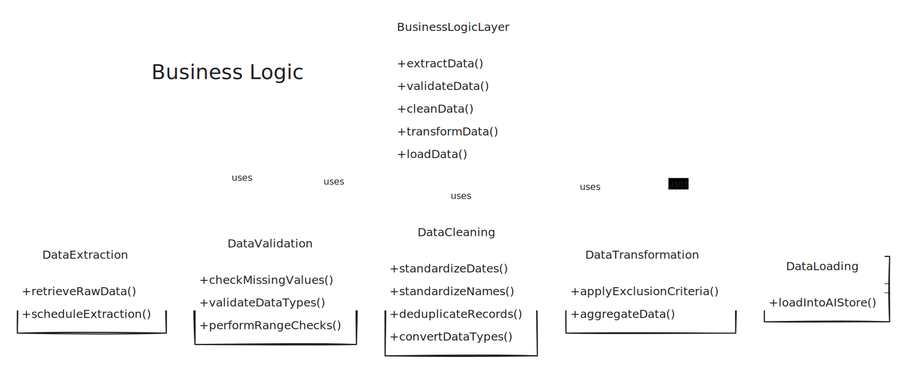

# DDS AI-Powered Reporting System: Technical Implementation

This document outlines a technical implementation plan for the DDS AI-powered reporting system. Drawing upon the information discussed and the provided database schema (source), this proposal aims to provide a clear roadmap for development.

#### I. Project Scope & Objectives

The primary objective of this project is to develop and deploy a robust AI-powered reporting system for DDS dealerships. This system will leverage existing data within the dds\_managed\_db database to generate actionable insights, streamline reporting processes.

**Key Project Deliverables:**

1. **Reporting Dashboard:** Develop an interactive UI with a strong emphasis on design.
2. **AI Model Integration:** Integrate OPENAI's GPT-4 model via APIs in a `Python` environment.
3. **Data Cleaning and Preprocessing Pipeline:** Implement a robust pipeline in the Business Logic Layer (BLL) to handle extraction, validation, cleaning, transformation, and loading of data into an AI-ready format.

#### II. System Architecture

The proposed system will adopt a two-database architecture, ensuring data integrity and facilitating a streamlined data flow.

<figure><figcaption>
High level Overview
</figcaption></figure>

**A. Raw Data Repository**

* **Purpose:** Maintain a secure and pristine copy of all raw data extracted from the DDS Dealership Management System (DMS).
* **Implementation:** This repository will utilize the existing dds\_managed\_db database. No structural changes to this database are proposed at this stage to ensure compatibility with current systems.

**B. Business Logic (BL) - Data Processing Engine**

* **Purpose:** Serve as the core data processing engine responsible for extracting data from the Raw Data Repository, performing cleaning and transformation operations, and loading the processed data into the AI-Ready Data Store.
* **Implementation:** The BLL will be implemented as a standalone component, potentially as a set of scripts or functions within a data pipeline framework. The choice of technology (e.g., Python with data processing libraries, cloud-based ETL tools) will be determined based on performance requirements and integration considerations with the existing DDS infrastructure.
* **Key Functions:**
  * **Data Extraction:** Retrieve raw data from designated tables within the dds\_managed\_db database at regular intervals, based on the desired reporting frequency (e.g., hourly, daily).
  * **Data Validation:** Upon ingestion, subject the raw data to rigorous validation checks:
    * **Missing Values:** Detect and handle missing data points in critical fields, either through exclusion or imputation techniques.
    * **Data Type Validation:** Enforce correct data types (e.g., ensure date fields contain valid date formats) as defined in the database schema.
    * **Data Range Checks:** Identify and flag values that fall outside of expected or logical ranges.
  * **Data Cleaning:** Standardize and clean the data to ensure consistency and accuracy:
    * **Date Standardization:** Convert all date fields to a uniform format, such as YYYY-MM-DD, eliminating inconsistencies arising from varying regional or system-specific date representations.
    * **Name Standardization:** Implement algorithms to standardize names (salesperson, customer, sales manager) to address inconsistencies due to nicknames, abbreviations, or different data entry conventions. This will involve:
      * **String Matching & Normalization:** Employing techniques like fuzzy matching and text normalization (converting to lowercase, removing special characters) to identify and merge variations of the same name.
      * **Deduplication:** Develop logic to identify and merge duplicate customer or salesperson records based on matching criteria (e.g., matching names, contact details).
    * **Data Type Conversion:** Transform data types to meet the requirements of the AI models or reporting tools (e.g., converting text-based numerical fields to numerical data types).
  * **Data Transformation:**
    * **Customizable Exclusion Criteria:** Implement mechanisms for DDS dealerships to define and apply their unique business rules to filter transactions for reporting (e.g., excluding "On the House" sales, specific salespersons, or cancelled deals).
    * **Data Aggregation:** Aggregate data at various levels to prepare it for analysis and reporting. This will involve:
      * **Time-Based Aggregation:** Aggregate data into daily, weekly, monthly summaries as needed.
      * **Dimensional Aggregation:** Group data by relevant dimensions, such as salesperson, sales manager, vehicle model, or lead source, and calculate aggregated metrics (e.g., total sales, average deal size, lead conversion rates).
  * **Data Loading:** Efficiently load the processed and transformed data into the AI-Ready Data Store.

**C. AI-Ready Data Store**

* **Purpose:** Store the cleaned, validated, standardized, and transformed data in a format optimized for AI model consumption and efficient report generation.
* **Implementation:** A new database schema will be designed specifically for the AI-ready data. This design will consider the specific data requirements of the chosen AI models and reporting tools to ensure optimal performance.
* **Data Modeling:** The data schema will be structured to facilitate efficient querying and analysis by AI models. This may involve denormalization techniques or the creation of aggregated tables for specific reporting needs.

#### IV. Next Steps

This proposal serves as a starting point for the technical implementation of the DDS AI-powered reporting system. The next steps involve:

* **Development & Testing:** Develop, test, and iterate on the system components in an agile manner, ensuring alignment with DDS requirements and expectations.

### <mark style="color:red;">Examples of Data Scenarios and System Handling Highlighting the approach</mark>

**A. Missing "Sales Date" Handling**

* **Scenario:** A sales record within the appointments table lacks a "Sales Date," despite containing other relevant information.
* **System Action:** Due to the critical nature of "Sales Date" for most analyses, the record is excluded from the AI-Ready Data Store by the BLL.
* **Impact:** This prevents incomplete or inaccurate data from skewing sales trend analysis, salesperson performance evaluations, and sales cycle calculations.

**B. Name Standardization and Deduplication**

* **Scenario:** The bdc\_lead\_sources table contains variations of the same salesperson name ("John Smith", "J. Smith", "[john.smith@dealership.com](mailto:john.smith@dealership.com)") and duplicate customer records with minor inconsistencies in their contact details.
* **System Action:** The BLL's name standardization algorithms identify and merge name variations. Simultaneously, deduplication logic identifies and merges duplicate customer records based on defined matching criteria (e.g., matching names, addresses, phone numbers).
* **Impact:** This ensures consistent reporting of salesperson performance and accurate customer segmentation. Sales figures are correctly attributed to the standardized salesperson name, and marketing campaigns target unique customers, avoiding redundant communications.

**C. Missing Value Imputation - Vehicle Trim**

* **Scenario:** The "Vehicle Trim" field in the bdc\_lead\_sources table has missing values for some leads.
* **System Action:** The BLL implements "mode imputation," filling in the missing values with the most frequent "Vehicle Trim" level for the corresponding "Vehicle Model."
  * Example: If "LE" is the most common trim level for the Toyota Camry, missing "Vehicle Trim" values for Camry leads are imputed as "LE."
* **Impact:** This improves dataset completeness, enabling more comprehensive analysis of customer preferences and inventory trends. Imputing with the mode minimizes potential bias, especially if the mode represents a significant majority of the data.

**D. Data Aggregation - Sales Performance by Salesperson**

* **Scenario:** The dealership needs a weekly report on each salesperson's performance, including the number of units sold, total gross profit, and average deal size.
* **System Action:**
  * The BLL extracts data from the appointments table (for sales records) and the bdc\_lead\_sources table (for lead and salesperson information).
  * **Aggregation:** The BLL groups this data by salesperson and week, then calculates:
    * **Units Sold:** The total number of vehicles sold by each salesperson each week.
    * **Total Gross:** The sum of gross profit generated by each salesperson each week.
    * **Average Deal Size:** The average gross profit per vehicle sold by each salesperson each week.
* **Impact:** This aggregated data, stored in the AI-Ready Data Store, enables the reporting dashboard to generate the desired weekly performance report efficiently. The report provides insights into individual salesperson performance trends and allows for comparisons across the sales team.

**F. Customizable Exclusion Criteria - Marketing ROI Analysis**

* **Scenario:** The dealership wants to analyze the effectiveness of their social media advertising campaigns, specifically focusing on leads generated through Facebook. They want to exclude leads from other sources (e.g., website forms, phone calls) to isolate the impact of Facebook campaigns.
* **System Action:** The dealership utilizes the BLL's customizable exclusion criteria to filter the bdc\_lead\_sources table, including only records where "lead\_source" is "Facebook."
* **Impact:** The filtered dataset provides a precise view of leads originating from Facebook, enabling the dealership to calculate the true cost per lead, conversion rate, and overall ROI of their Facebook advertising efforts.


Next, we will explore in detail how the AI operates.


