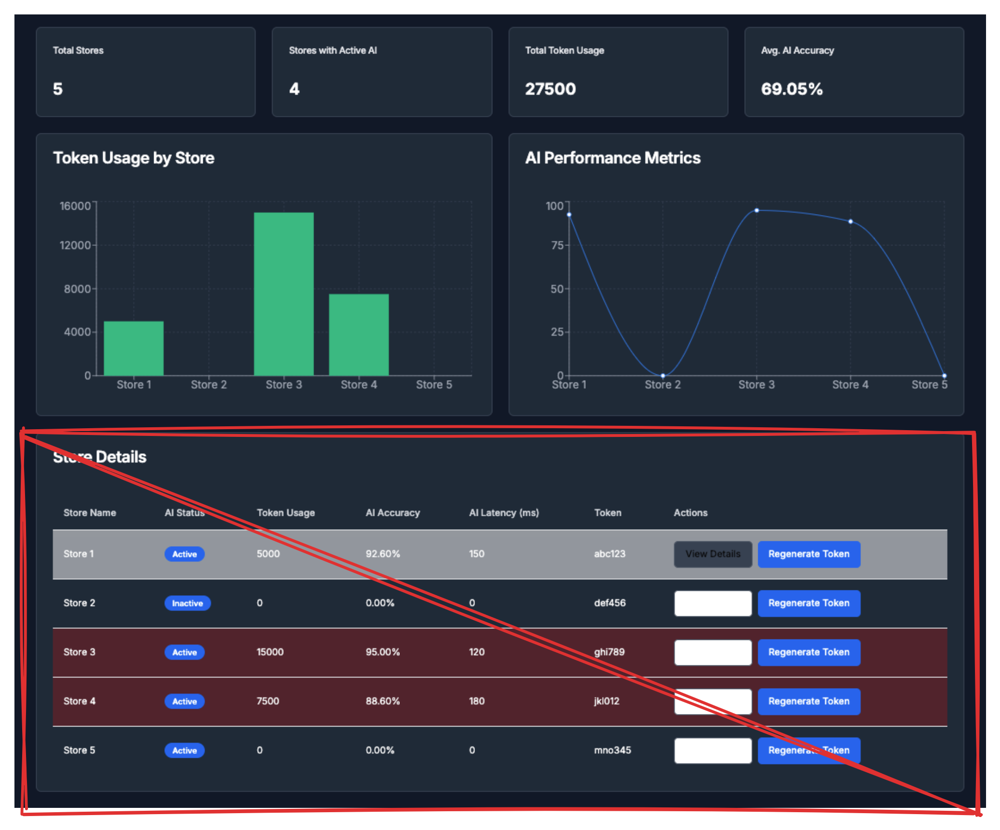

# Page

```mermaid
subgraph \"Data Cleaning & Transformation (BLL)\"
    D --> G[\"Data Validation\"]
    G --> H[\"Date Standardization\"]
    H --> I[\"Name Standardization\"]
    I --> J[\"Missing Value Handling\"]
    J --> K[\"Customizable Exclusion Criteria\"]
    K --> L[\"Data Aggregation\"]
    L --> D
end
F --> M[\"Advanced Insights\"]
M --> N[\"Enhanced Decision Making\"]
```

The advanced insights generated from the AI models and reporting engines are not only crucial for making data-driven decisions but also provide a competitive edge in the market. These insights can include trend analysis, sales forecasting, customer behavior analysis, and anomaly detection, among others.

For example, the advanced insights might identify sales patterns that can inform inventory management, marketing strategies, and customer engagement initiatives. The enhanced decision-making process, supported by these insights, ensures that business strategies are both proactive and reactive to market demands and operational challenges.

Integrating such a comprehensive Dealership Management System can lead to:

* Improved inventory turnover through precise demand forecasting.
* Enhanced customer satisfaction by understanding and anticipating customer needs.
* Increased operational efficiency by automating routine tasks and reducing errors.
* Better financial performance by identifying cost-saving opportunities and optimizing pricing strategies.

In summary, the data-driven approach supported by the DMS ensures a holistic view of the dealership operations, enabling sustainable growth, efficiency, and customer satisfaction. The architecture and flow, as visualized in the provided diagrams, highlight the strategic importance of each component in achieving an advanced, insightful, and effective dealership management system.

```mermaid
{% @mermaid/diagram content="graph LR A["Dealership Management System (DMS)"] --> B["Data Extraction"] B --> C{"Raw Database"} C --> D{"Business Logic Layer (BLL)"} D --> E{"AI-Ready Data Store"} E --> F["AI Models & Reporting Engine"]
subgraph \"Data Cleaning & Transformation (BLL)\"
    D --> G[\"Data Validation\"]
    G --> H[\"Date Standardization\"]
    H --> I[\"Name Standardization\"]
    I --> J[\"Missing Value Handling\"]
    J --> K[\"Customizable Exclusion Criteria\"]
    K --> L[\"Data Aggregation\"]
    L --> D
end
F --> M[\"Advanced Insights\"]
M --> N[\"Enhanced Decision Making\"]
" %}
```

```mermaid
```

<figure><figcaption></figcaption></figure>

```mermaid
graph TD
  Mermaid --> Diagram
```
